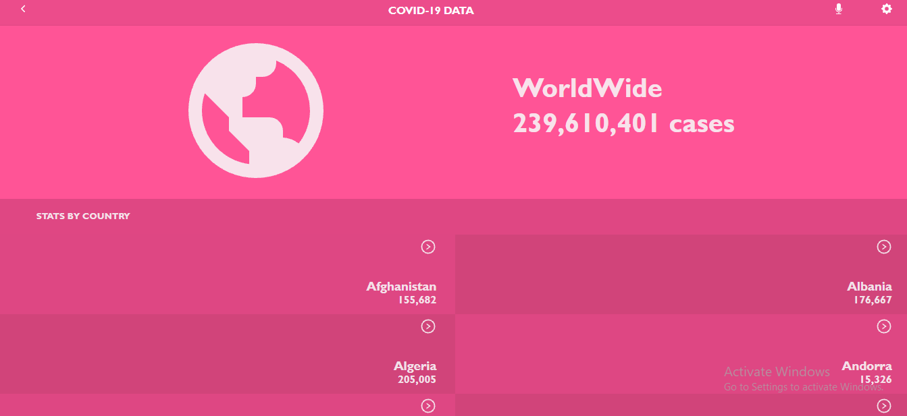

# COVID19 DATA:

<!-- ### Rockets (Homepage)

### Missions Page

### My Profile Page
 -->

This React capstone project is about building a mobile web application to check a list of metrics (numeric values). The application will allow users to check the statistic of the COVID19 cases for more than 190 countries with a historic data included. 

## Getting started :
This project was bootstrapped with [Create React App](https://github.com/facebook/create-react-app) and Redux Library.

to get a local copy in your machine :

- clone the repository running `git clone <ur>` in your terminal.
- run `npm install` on the root folder of the project.

## Available Scripts

In the project directory, you can run:

### `npm start`

Runs the app in the development mode.\
Open [http://localhost:3000](http://localhost:3000) to view it in the browser.

The page will reload if you make edits.\
You will also see any lint errors in the console.

### `npm test`

Launches the test runner in the interactive watch mode.\
See the section about [running tests](https://facebook.github.io/create-react-app/docs/running-tests) for more information.

### `npm run build`

Builds the app for production to the `build` folder.\
It correctly bundles React in production mode and optimizes the build for the best performance.

The build is minified and the filenames include the hashes.\
Your app is ready to be deployed!

See the section about [deployment](https://facebook.github.io/create-react-app/docs/deployment) for more information.

## Live Demo

[Live Demo](/)

## Author

👤 **Ali Abbani**

## Ali's Profile

- [GitHub](https://github.com/aliabbani)
- [AngelList](https://angel.co/u/ali-abbani)
- [LinkedIn](https://www.linkedin.com/in/ali-abbani-8b6246150/)

## 🤝 Contributing

Contributions, issues, and feature requests are welcome!

Feel free to check the [issues page](https://github.com/aliabbani/Metrics-webapp/issues).

## Show your support

Give a ⭐️ if you like this project!

## Acknowledgments

- Hat tip to anyone who’s code was used
- Inspiration

## 📝 License

This project is [Microverse](https://www.microverse.org/) licensed.

Original design idea by Nelson Sakwa on [Behance](https://www.behance.net/gallery/31579789/Ballhead-App-%28Free-PSDs%29).
